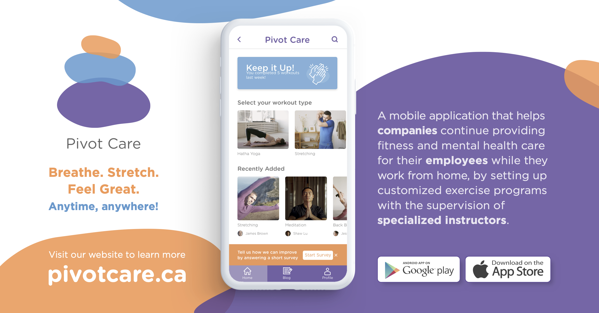
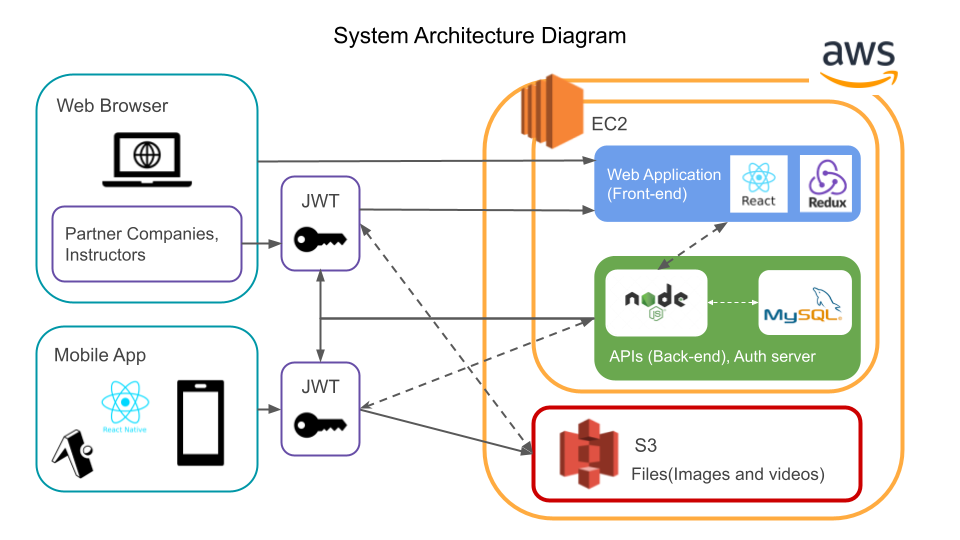

🚧️ This app is still WIP 🚧️
# About

Pivot Care is a mobile application that helps companies to continue providing fitness and mental health care for their employees while they working from home.

(This project is for portfolio and investigation not for release or monetize.)

## 👆Click an Above Image to Play a Promotion Video!!!
(This image and video were created by awesome designers. If you get interested in who created design materials, please check the team member section of this link https://pivotcare.ca/about)

# Why I (our team) created this web application
I created this mobile app to show my development skill.

I can create an interactive UI using React Native.

I am able to handle multiple HTTP requests and display the results by understanding of the React component lifecycle and the concept of the component tree.

I have implemented an authentication system of this app by using Json Web Token. I developed an authentication server.(https://github.com/TOMO-YOSHI/Capstone-WebApp)

# System Architecture

## Infrastracture
To deploy the back-end of the app, I am using AWS EC2. I have set up a Node.js web server and MySQL database server on it. Moreover, some other networking settings have been done at the same time, such as reverse proxy, firewall, and SSL.
To automate a deployment process, I have adopted CodePipeline and CodeDeploy, which connect a GitHub repository and EC2.

## Mobile app
In the mobile development, I utilized modern technology, React Native. To manage users' login condition and implement the search functionality, I used Context to manage global states effectively.

## Back-end
Our API server is created by using Node.js and MySQL.

### Authentication and Authorization
I have developed authentication and authorization functionality to implement a login/sign-up function on the front-end. JWT is used to issue tokens, and a token validation is applied to APIs which return confidential information. The authentication server is used for both mobile and web apps.

### S3 storage
S3 storage is used to deliver data. Image and video files stored in the storage are displayed on the UI of the mobile app.